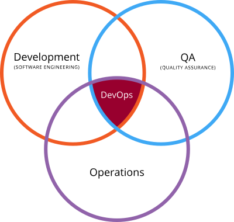
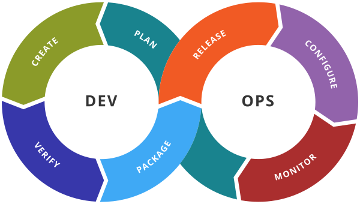
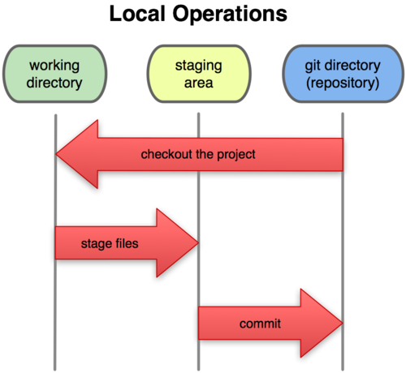
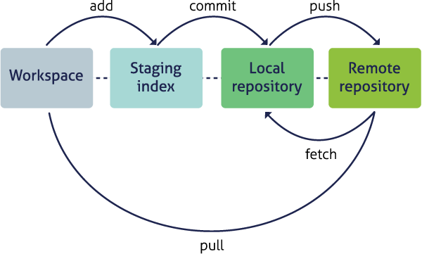

note:

- bron: Wikipedia
- vroeger was er zo goed als geen overlap tussen de cirkels
- samenwerking tussen ontwikkelaars, systeembeheer, testing
  - vroeger gooide elke partij een product "over het muurtje" voor de volgende
    - leidt altijd tot vingerwijzen en opstroppingen in het bedrijfsproces
- meer verantwoordelijkheid opnemen om een globaal beter resultaat te behalen
- **integratie** van verschillende disciplines

---

## Wat is DevOps niet?

- een aparte job
- een aparte afdeling
- een marketingbegrip

---

## Loop en concepten

note:
- tools voor zowat elk deel van de lus
  - **ruwweg**
    - Git voor plan, create, verify
    - Docker voor package, release
    - Docker Compose voor configure en monitor
- doelstelling: deze lus zo vlot mogelijk laten vloeien
  - automatisatie is belangrijk
- de tools "geven" je niet meteen DevOps, maar maken het mogelijk te stroomlijnen

---

[studiewijzer](https://ects.ap.be/ects/opleidings-onderdeel/239990?login=true)

note:
- zie ook DigitAP: lijst met verschillen met vorig jaar

---

# Git

note:
- versiebeheersysteem
  - "SCM", ook wel "VCS": source code management / version control system
- vraag (voor wie nog geen labo heeft gehad): wat doe je als je code voor een opdracht eerst bijna leek te werken en plots hopeloos defect is?
- **geen afkorting!**

---

## Versiebeheer, oude stijl

note:
- demonstreer even aanpak: HISTORY.md (met datums), Pythonscriptje, eventueel Dropbox,...
  - wat als ik wil samenwerken?
  - wat als ik twee technieken wil vergelijken?
  - wat als ik vergeetachtig ben?
  - wat als mijn verbinding slecht is?
  - ...

---

## Ontstaan

note:
- Git: uitgewerkt voor ontwikkeling Linux kernel
- momenteel dominant systeem voor versiebeheersysteem
  - wie heeft er ooit van CVS, Subversion, Mercurial, Perforce, TFS of Jujutsu gehoord?
- karakteristieken afgestemd op Open Source
  - gedistribueerd (geen centrale server, iedereen heeft toegang)
  - offline bruikbaar
  - zelf open source

---

## GitHub

note:
- niet hetzelfde
- Git is de technologie zelf
- GitHub is een website die het samenwerken via deze technologie toegankelijker maakt
  - er zijn alternatieven, intussen in veel opzichten klantvriendelijker

---

## Basisprincipe

note:
- superbelangrijke figuur
- vergelijk werken in Git met werken met een logboek
  - je doet iets (meestal code schrijven)
  - je noteert bv. elke dag eerst alles in potlood
  - aan het einde van de dag gum je wat zaken weg, structureer je en noteer je in pen
- geeft je al een extreem handig logboek van je code
- **korte demo, commando's onthouden is hier niet nodig, wel het idee vatten**
  - repo aanmaken
  - klein programmaatje schrijven en committen
  - geldige aanpassing
  - aanpassing die bug introduceert
  - wegwerken bug
  - geschiedenis opkuisen
- `git log` geeft een (rechte) tijdlijn
  - heel waardevol dat we kunnen teruggaan

---

## Commits

note:
- "checkpoints" voor je code (of ander project)
  - afgebakende momentopnames, niet gewoon geïdentificeerd via timestamp (zoals een Dropbox, OneDrive,...)
- uniek identificeerbaar via hash
- verschijnen pas na `git commit`, kan pas na `git add`
- bekijk even output van `git log`

---

note:
- remote is een "andere instantie" van dezelfde repository
- kleine demonstratie: project van vorige slide op Codeberg hosten, up-to-date brengen, clonen en pullen in tweede repository
- heel vaak wordt één remote aangeduid als "origin", i.e. de "bron van de waarheid"
  - bv. de versie van de broncode op de server van het bedrijf in plaats van op de laptop van een developer
- toon zeker ook `git remote`
- toon ook `git clone` van publiek project gevolgd door poging om te pushen
  - zal niet lukken, maar zullen later in semester kijken naar branching workflows

---

## Belangrijkste termen:

- working directory
- staging area / index
- repository
- (add/stage)/commit/push/pull

---

## Doelstelling in dit vak

note:
- denk terug aan de DevOps cyclus
- hoe meer we kunnen automatiseren, hoe beter
- ideale scenario: we registreren een aanpassing in Git, de testen starten vanzelf, de build gebeurt vanzelf,...

---

## To be continued

note:
- (in tegenstelling tot vorig jaar) niets over branching ⇒ we keren hier later in het semester op terug
